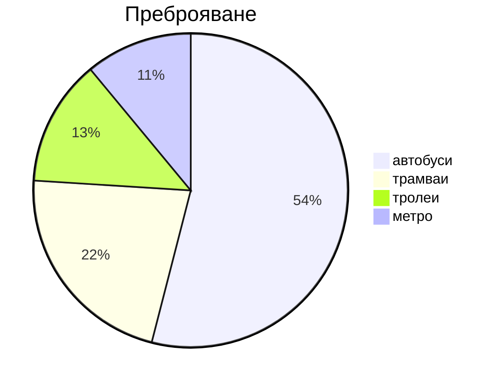

   
Пътникокилометри (ИП) Пропътуваните пътникокилометри се изчисляват за всяка линия, за даден ден, като се използва информация за: 
● дължината на всеки сегмент (разстоянието между две спирки) по маршрута на линията; ● броят осъществени курсове във всеки от тези сегменти; 
● броят пътници във всеки от сегментите, изчислен на база снимки от камерите.

Броят пътници по всеки сегмент, за всеки изминат курс през деня, се умножава по дължината в километри на съответния сегмент. Сумата на така получените произведения представлява пътникокилометрите за дадената линия за деня. В допълнение, от информацията за пътуванията, описана в секция „Пътникопоток“, се прави оценка на средната дистанция на пътуване за всяка една линия според деня. Използвайки общо пропътуваните пътникокилометри за линията и средната дистанция на пътуване по линията, се апроксимира броят на извършените пътувания/броят на пътниците по тази линия за съответния ден.

## Анкета План Мобилност

## 2021 ЦГМ - Нова тикет система - данни

## 2018 Преброяване на линии наземен МГТ, засегнати от трети метродиаметър

## 2014 Натовареност на линиите

## 2011 Преброяване пътници обществен транспорт

ДАННИ ОТ ПРЕБРОЯВАНЕ НА ПЪТНИЦИТЕ, ПОЛЗВАЩИ ОБЩЕСТВЕН ГРАДСКИ ТРАНСПОРТ ПО ВИДОВЕ ТРАНСПОРТ

| Вид транспорт | брой пътници делник 2011 г. |брой пътници делник 2014 г.| ръст | брой пътници месечно 10.2011 | брой пътници месечно 10.2014     | ръст | брой пътници годишно 2011 | брой пътници годишно 2014 | ръст |
| --- | --- | --- | --- | --- | --- | --- | --- | --- | --- |
| автобуси крайгр. | 140370 | 121627 | **\- 15,4%** | 3593472 | 3223116 | **\-11,5%** | 42582643 | 34906341 | **\-22%** |
| автобуси гр. | 651874 | 552984 | **\-17,9%** | 16687974 | 14764673 | **\-13,0%** | 197752497 | 157396694 | **\-25.6%** |
| тролейбуси | 175140 | 147704 | **\-18,6%** | 4325958 | 3840304 | **\-12,6%** | 51262602 | 41590492 | **\-23.3%** |
| трамваи | 366018 | 321883 | **\-13,7%** | 9077246 | 8368958 | **\-8,5%** | 107565370 | 90635815 | **\-18.7%** |
| метро | 197951 | 300666 | **34,2%** | 4911347 | 8117970 | **39,5%** | 58199462 | 87917615 | **33,8%** |
| **общи** | 1531353 | 1444864 | **\-6,0%** | 38595997 | 38315021 | **\-0,7%** | 457362574 | 412446957 | **\-10,9%** |
{.dense}

## 2010 ГПОД

| **вид транспорт**  | **2010 г.** **бр. пътувания** |**отн. дял**| **2002 г.** **брой пътувания**  |**отн. дял**| **разлика** **ниво** | **%**|
| --- | --- | --- | --- | --- | --- | --- |
| автобуси | 240 764 840 | 54% | 308 353 210 | 60% | спад | 23% |
| трамваи | 100 740 488 | 22% | 131 477 950 | 26% | спад | 23% |
| тролеи | 57 810 861 | 13% | 62 110 601 | 12% | спад | 7%  |
| метро | 51 398 670 | 11% | 12 292 800 | 2%  | ръст | 318% |
| **общо** | **450 714 859** | **100%** | **514 234 561** | **100%** | **спад** | **12%** |
{.dense}

В резултат рационализираната маршрутна мрежа и пешеходният достъп до спирките и метростанциите на масовия градски транспорт осигуряват практически пълно покритие на градската територия.